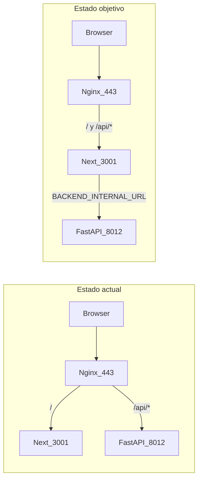

# Plan: corregir 502 y arquitectura en producción (FacturacionIMA)

**Contexto (sin `git pull`):** El 502 en HTML ocurre cuando Nginx no alcanza Next en `3001` (históricamente ~10k reinicios PM2 por `.next` corrupto). En paralelo, Nginx envía **todo** `/api/*` a FastAPI en `8012` y **omite** las 30 API Routes de Next en [`frontend/src/app/api/`](frontend/src/app/api/), provocando 404/errores en login (`/api/me`), dashboard (`/api/sync-sheets`) y rutas que solo existen como proxy en Next.



PM2 ya define lo correcto en [`ecosystem.split.config.js`](ecosystem.split.config.js): `BACKEND_INTERNAL_URL=http://127.0.0.1:8012`, `NEXT_PUBLIC_BACKEND_URL=/api`. El problema es Nginx y fallbacks hardcodeados a **8008** (puerto muerto en este servidor).

---

## 1. Nginx: un solo upstream para HTTP(S)

**Archivo a actualizar:** [`~/nginx/sites-available/facturacionima.conf`](nginx/sites-available/facturacionima.conf) (y el vhost **activo** en el servidor — hoy el dominio responde pero `/etc/nginx/sites-enabled/` no lista este site; hay que localizar dónde está incluido antes de `nginx -s reload`).

**Cambio:** eliminar el bloque `location /api/` que hace `proxy_pass http://localhost:8012/`. Dejar solo `location /` hacia `http://127.0.0.1:3001` con headers de proxy ya presentes (`Host`, `X-Forwarded-Proto`, `X-Forwarded-For`).

**Resultado:** el navegador sigue llamando `/api/...`; Next atiende esas rutas y proxyea internamente a `8012`.

**Nota de seguridad post-ataque:** no tocar certificados ni reglas fuera de este `server_name`; solo proxy. Validar con `nginx -t` antes de reload.

---

## 2. Unificar puerto backend en proxies Next (8008 → 8012 / env)

Crear un helper mínimo reutilizable, por ejemplo [`frontend/src/lib/backendUrl.ts`](frontend/src/lib/backendUrl.ts):

```ts
export function getBackendInternalBase(): string {
  return (process.env.BACKEND_INTERNAL_URL || 'http://127.0.0.1:8012').replace(/\/$/, '');
}
export function getBackendProxyBases(): string[] {
  const internal = getBackendInternalBase();
  const publicBase = process.env.NEXT_PUBLIC_BACKEND_URL?.trim();
  return [internal, publicBase, 'http://127.0.0.1:8012'].filter(Boolean) as string[];
}
```

**Prioridad de cambios (críticos):**

| Archivo | Problema hoy |
|---------|----------------|
| [`frontend/src/app/api/sync-sheets/route.ts`](frontend/src/app/api/sync-sheets/route.ts) | URL fija `http://127.0.0.1:8008/sheets/sincronizar` |
| [`frontend/src/app/api/admin/empresas/route.ts`](frontend/src/app/api/admin/empresas/route.ts) y variantes `[id]` | Usan `NEXT_PUBLIC_BACKEND_URL` (`/api`) como base → recursión o HTML |
| Resto de `frontend/src/app/api/**/route.ts` + `internal-api/**` | Fallback `'http://127.0.0.1:8008'` (~25 archivos según grep) |

**Regla:** en server-side `fetch` al backend, **siempre** `BACKEND_INTERNAL_URL` primero; `NEXT_PUBLIC_BACKEND_URL=/api` solo para el cliente en el browser. Fallback por defecto: **8012**, no 8008.

Archivos ya parcialmente correctos ([`api/me/route.ts`](frontend/src/app/api/me/route.ts), [`api/auth/me/route.ts`](frontend/src/app/api/auth/me/route.ts)): migrar al helper para no divergir.

---

## 3. Estabilizar Next y evitar bucle 502 en PM2

**Archivo:** [`scripts/frontend_start.sh`](scripts/frontend_start.sh)

Ampliar validación post-build (además de `BUILD_ID`, `required-server-files.json`, `middleware-manifest.json`):

- Comprobar existencia de `.next/routes-manifest.json` y que `dataRoutes` sea array (evita `routesManifest.dataRoutes is not iterable`).
- Si falla validación: `rm -rf .next` + `npm run build` (comportamiento actual, pero con check explícito).

**Despliegue en servidor (operativo, no código):**

1. Liberar espacio en disco (disco al **94%** — riesgo de builds truncados tras el ataque).
2. `cd frontend && rm -rf .next && npm run build`
3. `pm2 restart FacturacionIMA-frontend --update-env`
4. Confirmar `pm2 describe FacturacionIMA-frontend` → `restarts` no sube y log muestra `Ready`.

Opcional en [`ecosystem.split.config.js`](ecosystem.split.config.js): subir `min_uptime` / bajar `max_restarts` para detectar fallos temprano (solo si queréis alertas más estrictas).

---

## 4. Verificación en producción (checklist)

Tras Nginx reload + rebuild + PM2 restart:

| Prueba | Esperado |
|--------|----------|
| `curl -sI https://facturador-ima.sistemataup.online/login` | 200 |
| `curl -sI https://facturador-ima.sistemataup.online/` | 307 → login |
| `POST /api/auth` (credenciales inválidas) | 401 JSON (vía Next, no 502) |
| `GET /api/me` sin cookie | 401 (Next → `/auth/me`), **no** 404 |
| `POST /api/sync-sheets` sin token | 401/403, **no** 404 |
| `GET /api/sheets/boletas` sin token | 401 |
| PM2 logs frontend (5 min) | Sin `routesManifest` ni `production-start-no-build-id` |

Login manual: tras credenciales válidas, `user_info` en localStorage y acceso a `/dashboard` y boletas.

---

## 5. Documentación

Actualizar [`README.md`](README.md) sección Nginx: modelo **un upstream (3001)**; FastAPI solo accesible en loopback `8012` vía `BACKEND_INTERNAL_URL`. Quitar ejemplo que manda `/api/` directo a 8008/8012.

---

## Alcance explícitamente fuera de este plan

- `git pull` / merge remoto (pedido explícito tras ataque).
- Cambios en lógica de negocio del backend o credenciales AFIP.
- Refactor grande del front (solo helper + proxies + script de arranque).
- Opción B (mantener `/api/` en Nginx hacia FastAPI) — descartada: duplicaría 30 rutas en Python y seguiría rompiendo cookies/proxies de Next.

## Orden de ejecución recomendado

1. Código: helper + fixes de proxies + `sync-sheets` + `admin/*`.
2. Build local limpio y prueba rápida `curl` a `127.0.0.1:3001/api/me`.
3. Nginx: quitar `location /api/`, reload.
4. Servidor: liberar disco → rebuild → `pm2 restart` frontend.
5. Checklist producción HTTPS.
